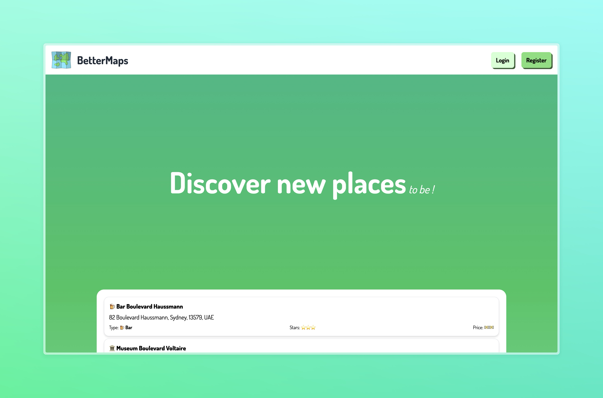

<div align="center">

# [BetterMaps](https://github.com/parlabarbedeMerlin/Better-Maps)

<p>A new way to see the world !</p>


</div>

## 📌 Index
- [📌 Index](#-index)
- [📜 About](#-about)
- [🚀 Technologies](#-technologies)
  - [Frontend](#frontend)
  - [Backend](#backend)
- [📦 Installation](#-installation)
- [📗 Documentation](#-documentation)
    - [Auth (/api/auth)](#auth-apiauth)
    - [Places (/api/places)](#places-apiplaces)

## 📜 About
Welcome to BetterMaps! Here, within our expansive platform, you'll discover a multitude of new destinations awaiting your exploration. Whether you're seeking vibrant eateries, cozy cafes, exhilarating entertainment spots, tranquil retreats, or even productive workspaces, BetterMaps is your ultimate guide. But it doesn't end there - we encourage you to contribute your own favorite spots, enriching our community with hidden gems and beloved locales, all waiting to be shared with the world.


## 🚀 Technologies
### Frontend
- [React](https://reactjs.org/)
- [headlessui](https://headlessui.dev/)
- [heroicons](https://heroicons.com/)
- [formik](https://formik.org/)
- [js-cookie](https://github.com/js-cookie/js-cookie)
- [clsx](https://github.com/lukeed/clsx)

### Backend
- [Next.js](https://nextjs.org/)
- [mongodb](https://www.mongodb.com/)
- [mongoose](https://mongoosejs.com/)
- [json web token](https://jwt.io/)
- [bcrypt](https://www.npmjs.com/package/bcrypt)
- [jose](https://www.npmjs.com/package/node-jose)
- [sendgrid](https://sendgrid.com/)
- [axios](https://axios-http.com/)
- [react query](https://react-query.tanstack.com/)
- [yup](https://www.npmjs.com/package/yup/)

## 📦 Installation
1. Clone the repository
```bash
git clone https://github.com/parlabarbedeMerlin/Better-Maps.git
cd Better-Maps
```

2. Configure the environment variables
```bash
cp .env.example .env.local
```

| Variable name    | required | Description                                                                                                                                           |
| ---------------- | -------- | ----------------------------------------------------------------------------------------------------------------------------------------------------- |
| DB_URL           | true     | The URL of the MongoDB database.                                                                                                                      |
| HOST_NAME        | true     | The running host of the application.                                                                                                                  |
| JWT_SECRET       | true     | The secret key for the JWT token.                                                                                                                     |
| SENDGRID_API_KEY | false    | The API key of the SendGrid service. _if you don't provide a correct value for this variable BetterMaps will not use an email to verify the profile._ |
| EMAIL            | false    | The email address of the sender. _if you don't provide a correct value for this variable BetterMaps will not use an email to verify the profile._     |


1. Install the dependencies
```bash
# using npm
npm install

# using yarn
yarn install

# using pnpm
pnpm install
```

4. Run the application
```bash
# using npm
npm run dev

# using yarn
yarn dev

# using pnpm
pnpm dev
```

5. Open your browser and navigate to [http://localhost:3000](http://localhost:3000)


## 📗 Documentation

1. ### API Documentation (/api/)
#### Auth (/api/auth)
POST /api/auth/register


| key             | Description                                                         |
| --------------- | ------------------------------------------------------------------- |
| email           | The email of the user.                                              |
| firstName       | The first name of the user.                                         |
| lastName        | The last name of the user.                                          |
| password        | The password of the user.                                           |
| confirmPassword | The confirmation of the password.(must be the same as the password) |

If all the fields are correct, the server will send an email to the user to verify the account.

---
POST /api/auth/login
| key      | Description               |
| -------- | ------------------------- |
| email    | The email of the user.    |
| password | The password of the user. |

> If the email and password are correct, the server will send a JWT token to the user and set a cookie with the token.

---
POST /api/auth/verify
| key         | Description            |
| ----------- | ---------------------- |
| verifyToken | The token of the user. |

> If the token is correct, the server will verify the account.


#### Places (/api/places)
GET /api/places
| Query parameter | Description                                |
| --------------- | ------------------------------------------ |
| skip            | The number of places to skip.              |
| limit           | The number of places to return.            |
| filters         | The filters to apply to the places (json). |


---
POST /api/places
> The body must contain the place object following the yup schema.


---
GET /api/places/:id
> The id is the id of the place. And the server will return the place object.

---
PATCH /api/places/:id
> The body must contain the place object following the yup schema.
> The id is the id of the place. And the server will update the place object.

2. ### Project Structure
- src
  - components -> All the components of the application.
    - forms -> All the forms of the application.
    - inputs -> All the inputs of the application.
    - nav -> The navigation bar of the application.
  - context -> All the context of the application.
  - utils -> All the utilities of the application.
    - auth -> All the utilities for the authentication.
      - password -> All the utilities for the password.
    - controllers -> All the controllers of the application.
    - database -> All the database utilities of the application.
      - models -> All the models of the application for the database.
      - schemas -> All the schemas of the application for the database.
    - mail -> All the utilities for the mail.
    - schema -> All the schemas of the application (yup).
    - pages -> All the pages of the application.
